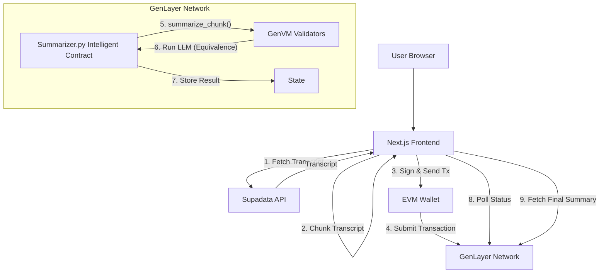

# GenLayer YouTube Summarizer Migration Guide

## 1. System Architecture

The system migrates from a centralized API model to a decentralized, validator-driven architecture.



## 2. GenLayer Concepts Used

-   **GenVM**: The execution environment that integrates a Python interpreter with an LLM. Unlike EVM, it can process natural language and non-deterministic logic.
-   **Intelligent Contracts**: Python classes (`YouTubeSummarizer`) that manage state and define AI-driven logic. They are deployed on GenLayer.
-   **Validator Consensus**: Multiple validators execute the `summarize_chunk` method. Using the **Equivalence Principle**, they must reach a consensus on the output of the LLM.
-   **Equivalence Principle**: Since LLMs are non-deterministic, we use `gl.eq_principle_strict_eq` (or semantic variants) to ensure all validators agree on the summary result before committing it to the blockchain state.

## 3. Intelligent Contract (Python)

See `genlayer_contracts/Summarizer.py` for the complete implementation.
Key methods:
-   `summarize_chunk`: Takes a text chunk, runs a prompt, votes on result.
-   `merge_summaries`: Takes stored chunks, runs a consolidation prompt.

## 4. Example Prompts

**Chunk Summarization:**
```text
You are a precise summarizer. Summarize the following transcript chunk.
Keep it concise, neutral, and factual. Max length: 150 words.
Transcript: {chunk_text}
Output ONLY the summary text.
```

**Merge Summarization:**
```text
You are an expert editor. Combine the following chunk summaries into a final coherent video summary.
Structure:
1. Overview (2-3 sentences)
2. Key Points (Bullet points)
3. Conclusion

Input Summaries: {combined_text}
Output ONLY valid JSON matching schema...
```

## 5. Best Practices & Optimization

### Chunk Sizing
-   **Validation**: Keep chunks between 1,000-3,000 characters. Too small = too many transactions (gas costs). Too large = context window overflow or timeout.
-   **Strategy**: Split by sentences/timecodes to avoid cutting words in half.

### Cost Control
-   **Filtering**: Pre-filter purely musical or silent sections in the frontend to save compute.
-   **Optimistic UI**: Show "Processing" states immediately.

### Maximizing Gen Points
-   **Complexity**: Using `merge_summaries` demonstrates multi-step reasoning, highly valued for Gen Points.
-   **Equivalence**: Implementing strict structural checks (JSON schema enforcement) requires validators to work harder to agree, demonstrating protocol robustness.
